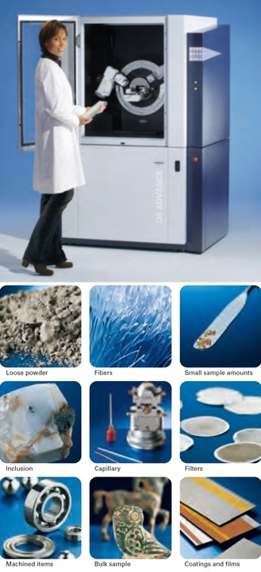
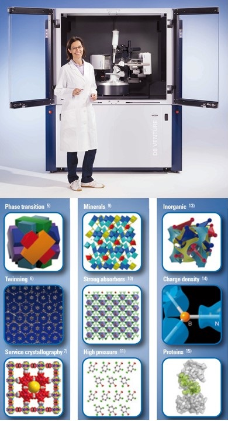

<h3>Table of Contents:</h3>
[Sample Preparation Lab](#spl)
 
[Raman Spectroscopy Lab](#rsl)
 
[X-ray Atlas Lab](#xal)
 
[Partmership for eXtreme Xtallography](#px2)

The Mineral Physics laboratories at HIGP occupy a space of approximately 3500 sq. ft.
 and house a wide variety of state of the art analytical instrumentation, majority of 
 which has been acquired over the years with generous help from the NSF EAR programs 
 and has been used for conducting advanced research and for student training in high-pressure 
 science. The laboratories are equipped for measurements of physical, chemical, spectroscopic, 
 micro-structural and nano-structural properties of minerals, advanced ceramics and ceramic composites, 
 single-crystalline and poly-crystalline minerals, silicate glasses and melts, and hard thin ceramic 
 films as well as metals and molten alloys. HIGP high pressure labs are not only a truly unique 
 resource for mineral science research and student training within the Hawaiian Islands and central 
 Pacific region, but also one of the largest and most comprehensive academic research facilities 
 in Mineral Physics in the country.
 
<h3>Diamond Anvil Cell Sample Preparation Lab</h3>

The HIGP Mineral Physics lab is well equipped for sample preparation in mineral science research.
 The sample preparation labs have just been renovated. Three modern stereo microscopes with long working 
 distance high magnification objectives and high resolution digital cameras offer capabilities for examining, 
 photographing, and documenting both starting samples, as well as products of HPHT experiments. 
 A high temperature oven is available for sample synthesis or removal of moisture from hygroscopic samples. 
 A laser gasket drilling system and an electric discharge drilling machine (EDM) are also available for 
 drilling sample chambers in gaskets for diamond anvil cell (DAC) experiments. 
 An existing gas loading system is being modified for visual and optical access to the high pressure chamber 
 for more reproducible and reliable gas loading and will be ready for use by our group in the near future.

 

<hl>

<h3>High Pressue and Temperature Raman Spectroscopy Lab</h3>

HIGP spectroscopy lab houses a high-resolution triple-grating Dilor Raman spectrometer with 
a cryogenically cooled CCD detector and long working distance high magnification microscope, 
optimized for experiments with diamond anvil cells at ambient temperature. Spectra Physics Model 
2020 Ar-ion laser supplies the incident light. This instrument has been the working horse of the 
Raman spectroscopy research at HIGP for many years, but is nearing retirement due to mechanical 
and electronic problems. A second custom Princeton Instruments micro-Raman system based on a modern 
Acton SP2360 imaging spectrograph, thermoelectric deeply depleted back illuminated PIXIS CCD detector 
and 1000 mW 532nm solid state laser has just been added. This new system will be coupled by broadband 
fiber optics transport with the Bruker D8 Venture unit of the X-ray Atlas. 

<hl>

<h3>X-ray Atlas Diffraction Lab</h3>

The resulting powder diffraction profiles are then fit to obtain perovskite volumes as a function of pressure and temperature.
From the extracted volumes, I construct high temperature equations of state for both Fe-bearing and Fe-free compositions, comparing with careful reanalysis of literature data.
Using Bayesian statistical techniques that are robust to outliers in the dataset, we are able to show that the thermal expansion trends with temperature for perovskite (even in the absence of iron) are considerably higher than previously thought.

<hl>

<h3><a name="px2">Partnership for eXtreme Xtallography</a></h3>

The resulting powder diffraction profiles are then fit to obtain perovskite volumes as a function of pressure and temperature.
From the extracted volumes, I construct high temperature equations of state for both Fe-bearing and Fe-free compositions, comparing with careful reanalysis of literature data.
Using Bayesian statistical techniques that are robust to outliers in the dataset, we are able to show that the thermal expansion trends with temperature for perovskite (even in the absence of iron) are considerably higher than previously thought.

