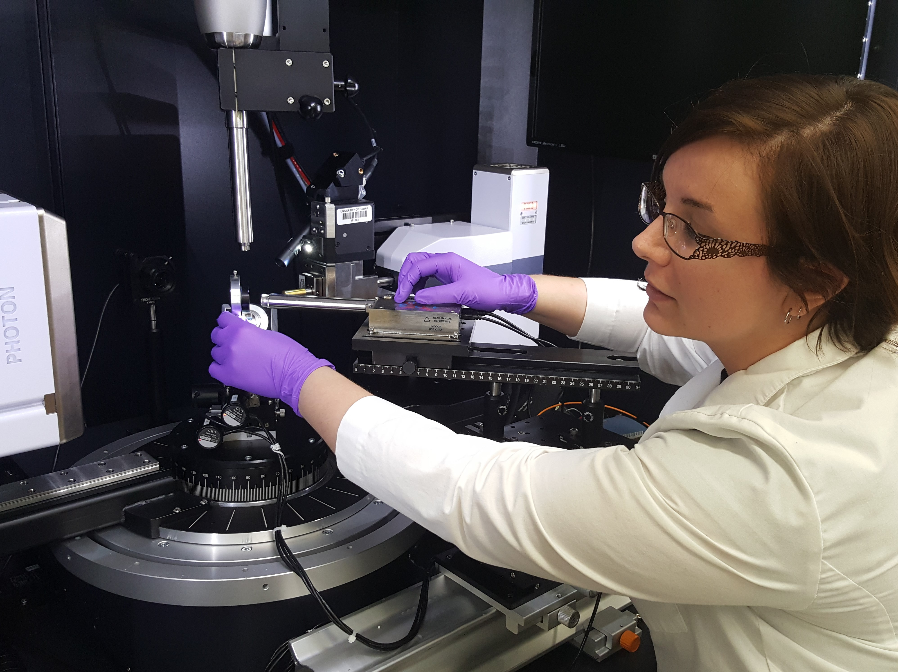

<h2>Lab Safety and Security:</h2>
All personnel, including students, using high-pressure research facilities at HIGP and Argonne National Lab 
is required to undergo formallized safety training. Our Lab Safety and Security website lists these requirements 
and provides access to documents describing safe procedures to operate all of lab interumentation, as well as MSDS 
sheets for all chemicals we use. 
 
<a href="https://pdera.github.io/labsafety.html"> Go to HIGP high-pressure Lab Safety and Security website</a>

<a href="https://pdera.github.io/booking.html">Book X-ray Atlas time</a>
 
<a href="https://www.dropbox.com/s/j9j8sp83tuppmfe/Atlas_all.mp4?dl=0" target="_blank">Video tour of the lab and software</a>
 
<a href="https://www.dropbox.com/s/e3ftcv8bvy04kz4/Brochure%20-%20D8%20QUEST%20VENTURE%20Chemical%20Crystallography%20-%20DOC-B86-EXS008%20low%20en.pdf?dl=0" target="_blank">D8 Venture brochure</a>
 
<a href="https://www.dropbox.com/s/x0v3hk3k0noj9ox/Cryostream-800.pdf?dl=0" target="_blank">Oxford Cryostream 800+ high/low T device brochure</a>
 
<a href="https://www.dropbox.com/s/g2uy2cvzotzwkyv/1%20D8%20Advance%20BR%202012%20rfs%20%281%29.pdf?dl=0" target="_blank">D8 Advance brochure</a>
 
<a href="https://www.dropbox.com/s/z4b6udlsbhk3cq0/1%20D8%20MTC%20TC%20Dome%20PS42.pdf?dl=0" target="_blank">TC Dome heating stage brochure</a>
 
<a href="https://www.dropbox.com/s/yr2938d4xn3s0c5/1%20Diffrac_EVA%20BR.pdf?dl=0" target="_blank">Diffrac.Eva brochure</a>
 
<a href="https://www.dropbox.com/s/8czznxu71sky0ee/1%20Diffrac%2B%20TOPAS%20V4%202011%20BR.pdf?dl=0" target="_blank">Diffrac.TOPAS brochure</a>
 

<h3>Table of Contents:</h3>
[HIG 105 Sample Preparation Lab](#spl)
 
[HIG 105 Raman Spectroscopy Lab](#rsl)
 
[HIG 154 X-ray Atlas Lab](#xal)
 
[POST 833 Mineral Physics Computer Lab](#mpcl)
 
[APS 13BMC Partmership for eXtreme Xtallography](#px2)

The Mineral Physics laboratories at HIGP occupy a space of approximately 3500 sq. ft.
 and house a wide variety of state of the art analytical instrumentation, majority of 
 which has been acquired over the years with generous help from the NSF EAR programs 
 and has been used for conducting advanced research and for student training in high-pressure 
 science. The laboratories are equipped for measurements of physical, chemical, spectroscopic, 
 micro-structural and nano-structural properties of minerals, advanced ceramics and ceramic composites, 
 single-crystalline and poly-crystalline minerals, silicate glasses and melts, and hard thin ceramic 
 films as well as metals and molten alloys. HIGP high pressure labs are not only a truly unique 
 resource for mineral science research and student training within the Hawaiian Islands and central 
 Pacific region, but also one of the largest and most comprehensive academic research facilities 
 in Mineral Physics in the country.
 
<h3>Diamond Anvil Cell Sample Preparation Lab</h3>

The HIGP Mineral Physics lab is well equipped for sample preparation in mineral science research.
 The sample preparation labs have just been renovated. Three modern stereo microscopes with long working 
 distance high magnification objectives and high resolution digital cameras offer capabilities for examining, 
 photographing, and documenting both starting samples, as well as products of HPHT experiments. 
 A high temperature oven is available for sample synthesis or removal of moisture from hygroscopic samples. 
 A laser gasket drilling system and an electric discharge drilling machine (EDM) are also available for 
 drilling sample chambers in gaskets for diamond anvil cell (DAC) experiments. 
 An existing gas loading system is being modified for visual and optical access to the high pressure chamber 
 for more reproducible and reliable gas loading and will be ready for use by our group in the near future.

 

<hl>

<h3>High Pressue and Temperature Raman Spectroscopy Lab</h3>

HIGP spectroscopy lab houses custom Princeton Instruments micro-Raman system based on Acton SP2360 imaging spectrograph, 
thermoelectric deeply-depleted back-illuminated PIXIS CCD detector and 1000 mW 532nm solid state laser (Fig. F3). 
The instrument is equipped with a motorized XYZ sample stage and is coupled with a 100 W 1064nm Nd-Yag heating fiber laser. 
The system is also be used for laser-cutting of diamond anvil cell gaskets. 

<hl>

<h3>X-ray Atlas Diffraction Lab</h3>

X-ray Atlas Advanced X-ray Diffraction system is a state of the art instrument being developed within the 
current NSF EAR IF project #1541516. The instrument is composed of two commercial X-ray diffractometers, Bruker D8 Venture single 
crystal instrument and D8 Advance high resolution powder diffractometer. Designed for analysis of bulk powder samples and thin films, the D8 Advance features 
a CuKa source and utilizes innovate optics allowing to switch between Bragg-Brentano and parallel beam geometries. The instrument is equipped with a TC Dome 
heating stage capable of reaching 1400C.

<hl>

The D8 Venture is equipped with high-brilliance Incoatec IuS 3.0 AgKa microfocus source and Helios focusing optics, and innovative Photon II CPAD detector.
The instrument also features Oxford Cryostream 800+ high/low temperature device. D8 Venture diffractometer is being customized with a range of new unique 
capabilities including (1) motorized XYZ stage as an alternative heavy-duty sample mounting platform for HPHT diamond anvil cells (2) fiber 
optics Raman spectrometer for ruby fluorescence measurements and (3) photodiode detector integrated into the X-ray beam stop assembly, 
which can be utilized for automated X-ray absorption/transmission scanning during diamond anvil cell experiments.

<hl>

<h3>POST 833 Mineral Physics Computer Lab</h3>

Mineral physics research involves extensive usage of computations. Analysis of experimental data is done using either 
commercial or custom computer codes. We often combine experiments with quantum mechanical simulations or geophysical modeling. 
POST 833 dedicated Mineral Physics Computer Lab serves these purposes. The lab is equipped with 7 shared access Windows workstations,
houses a Network Associated Storage (NAS) server, and offers modern teleconferencing capabilities. 

<hl>

<h3><a name="px2">Partnership for eXtreme Xtallography</a></h3>

COMPRES funds a joint project of the University of Hawaii, and GSECARS located at APS 
experimental station 13BM-C. Recent upgrade of the monochromator and focusing optics in 
that station allows to extend the experimental capabilities offered at 13BM-C to include powder and single 
crystal diffraction experiments in diamond anvil cell or on diamond inclusions. Unique design combining 
Newport 6-circle diffractometer with laser spectroscopy optics, currently under commissioning, enables single 
crystal X-ray diffraction measurements at combined high pressure and high or low temperature. The PX^2 instrument 
currently offers 30 keV incident energy beam, focused to 15 x 15 μm size, with supplementary imaging system, which 
allows accurate sample monitoring and positioning, ideal for the diamond anvil cell work. Several successful 
commissioning measurements of microcrystal samples in the air, solid inclusions in natural kimberlitic diamonds, as 
well as crystal inside diamond-anvil cell have already been performed. PX^2 has already started accepting general 
users for the 2015-2 APS run. The progress of the development of laser heating HPHT capabilities of this instrument 
will rely on the availability of X-ray Atlas as a prototyping and training instrument in Hawaii.

<hl>
