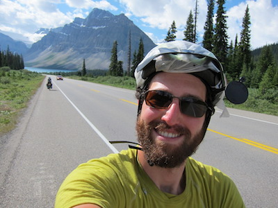

Like many geoscientists, I love the outdoors.
In my free-time, I enjoy riding my bicycle, hiking, and climbing.
In the last year, I have picked up cross-country skiing and kayaking as new Michigan-optimized activities.
This is a picture from a bike tour I went on which took me from Seattle over the cascades on to Glacier National Park, and then north on to Jasper national park in Canada.
I also love cooking and eating good food, especially home-made fermented foods like sauerkraut, yogurt, bread, and beer.

 

