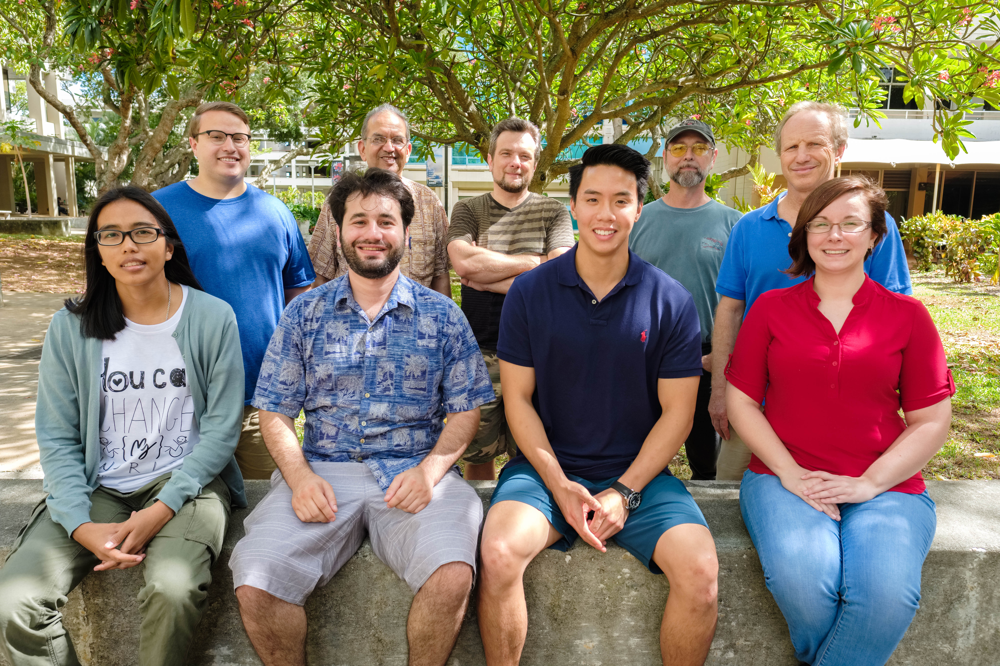

We are a Mineral Physics and Extreme Materials Science Research group at the Hawaii Institute of Geophysics and Planetology, University of Hawaii at Manoa.
Our research interests are focused mainly on understanding the effects of extreme pressure and temperature on the structure and 
properties of materials in the context of deep Earth geophysics and materials science.

<h2>News</h2>


