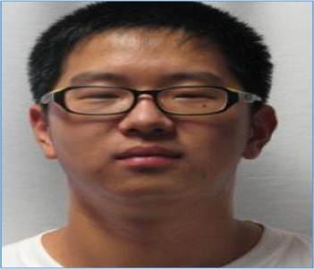
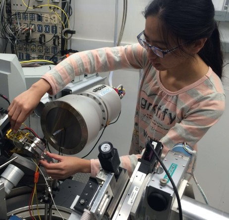

<h3>Table of Contents:</h3>
[Research Scientists](#rs)
 
[Graduate Students](#gs)
 
[Technical and Engineering Staff](#xal)

Our groups includes students and personnel based on campus, in Honolulu, as well as several scientists working
at the Argonne National Laboratory. Our graduate students are enrolled in PhD program administered through the Department of Geology 
and Geophysics, where Przemek holds a graduate faculty position. We also employ UHM undergraduates for shorter-term projects, and host visits of 
students from other Universities.  
 
We constantly look for new students, so if you find our research interesting, please contact Przemek by email (pdera@hawaii.edu) to learn about 
employment opportunities. 

<h2>Research Scientists</h2>

<h3>Dr. Jin S. Zhang, COMPRES Technology Officer</h3>

Jin's is a Research Scientist and Technology Officer for COMPTECH, COMPRES Technology Center at Argonne. Jin graduated with a PhD 
in Geophysics from University of Illinois at Urbana Champaign and her main specialty is Brillouin Spectroscopy. 

 

 

<h3>Dr. Dongzhou Zhang, PX^2 Beamline Scientist</h3>

Dongzhou is a Beamline Scientist for the Partnership for eXtreme Xtallography project at Argonne. He graduated from Caltech 
with a PhD in Geophysics. 

 

 

<h2>Graduate Students</h2>

<h3>Yi Hu, PhD Student</h3>

Yi’s theses research is focused on understanding metastable polymorphism in pyroxene minerals in the context of 
subduction zone modeling. Yi uses advanced crystallographic methods and synchrotron diffraction, as well as DFT 
calculations and phase equilibria modeling to study previously unknown discontinuous transformations in natural 
mantle pyroxenes and model synthetic end-members. Within this project we collaborate with several other CDAC-supported 
groups, including Princeton University, University of Arizona and Northwestern University.  

 

 

<h3>Hannah Shelton, PhD Student</h3>

Hannah’s thesis research focuses on understanding the role and consequences of hydrogen bonds in controlling compressional 
behavior and phase transitions in solids. Hannah uses advanced crystallographic methods, including time-resolved synchrotron 
diffraction and pressure-ramp approach to study two classes of materials: (a) organic solids that have similar molecular structures, 
and packing patterns, but differ in hydrogen bond formation ability and (b) isostructural couples of inorganic solids that are fully 
hydrated (e.g. hydroxide) and fully anhydrous (e.g. oxide). Within this project we collaborate with several other CDAC-supported groups, 
including University of Arizona, Northwestern University and University of Alabama. 

 

 

