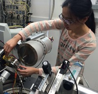

<h3>Table of Contents:</h3>
[Graduate Students](#spl)
 
[Research Scientists](#rsl)
 
[Technical and Engineering Staff](#xal)

My research interests span a broad range of topics including planetary science, geochemistry, geophysics, and statistical analysis.
In particular, the bulk of my work is focused on understanding the chemistry and thermodynamics of the Earth’s lower mantle.
I approach this topic with a variety of techniques, including diamond anvil cell experiments, thermodynamic modeling of first principles calculations, and simplified atomic-scale modeling.
I have also done work on determining the interior properties of extrasolar planets through their orbital evolution, as well as various applications of Bayesian statistical techniques toward understanding various fields in the geosciences.
Below I describe a number of these research projects in more detail, and you can see a list of my publications [here](publications.html).

<h2>Graduate Students</h2>

<h3>Yi Hu, PhD Student</h3>

Yi’s theses research is focused on understanding metastable polymorphism in pyroxene minerals in the context of 
subduction zone modeling. Yi uses advanced crystallographic methods and synchrotron diffraction, as well as DFT 
calculations and phase equilibria modeling to study previously unknown discontinuous transformations in natural 
mantle pyroxenes and model synthetic end-members. Within this project we collaborate with several other CDAC-supported 
groups, including Princeton University, University of Arizona and Northwestern University.  

 

<hl>

<h3>Hannah Shelton</h3>

Hannah’s thesis research focuses on understanding the role and consequences of hydrogen bonds in controlling compressional 
behavior and phase transitions in solids. Hannah uses advanced crystallographic methods, including time-resolved synchrotron 
diffraction and pressure-ramp approach to study two classes of materials: (a) organic solids that have similar molecular structures, 
and packing patterns, but differ in hydrogen bond formation ability and (b) isostructural couples of inorganic solids that are fully 
hydrated (e.g. hydroxide) and fully anhydrous (e.g. oxide). Within this project we collaborate with several other CDAC-supported groups, 
including University of Arizona, Northwestern University and University of Alabama. 

 

<hl>
