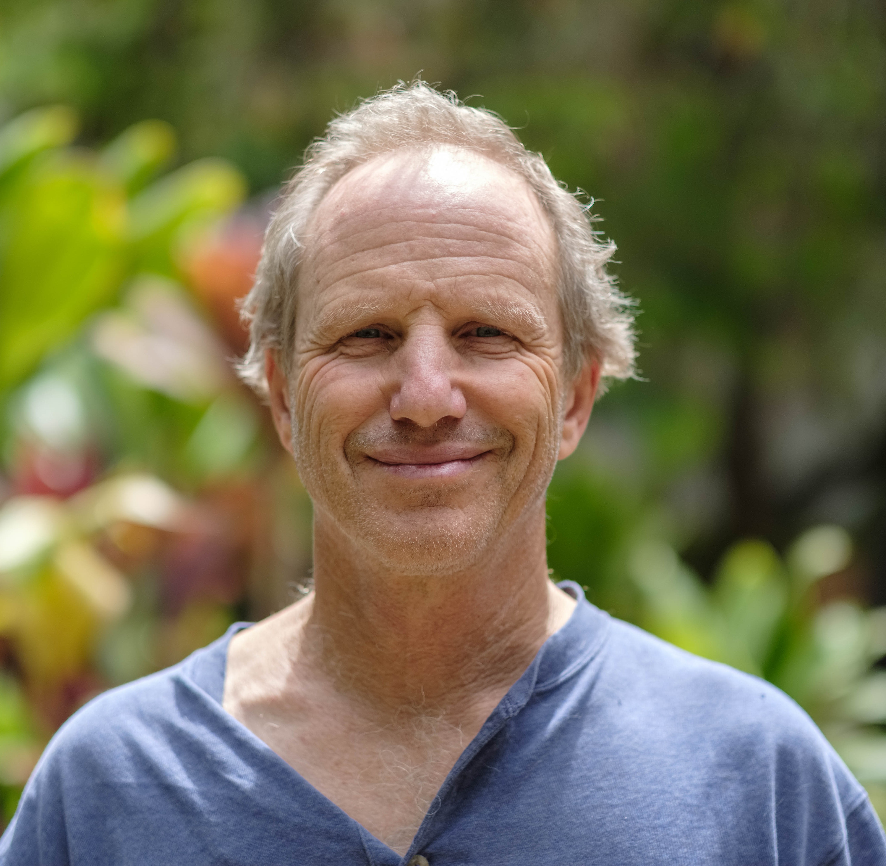

<h3>Table of Contents:</h3>
[Research Scientists](#rs)
 
[Postdoctoral Fellows](#pf)
 
[Graduate Students](#gs)
 
[Technical and Engineering Staff](#tas)
 
[People who moved on](#mo)

Our group includes students and personnel based on campus, in Honolulu, as well as several scientists working
at the Argonne National Laboratory. Our graduate students are enrolled in PhD program administered through the Department of Geology 
and Geophysics, where Przemek holds a graduate faculty position. We also employ UHM undergraduates for shorter-term projects, and host visits of 
students from other Universities.  
 
We constantly look for new students, so if you find our research interesting, please contact Przemek by email (pdera@hawaii.edu) to learn about 
employment opportunities. 

<h2>Research Scientists</h2>

<h3>Dr. Dongzhou Zhang, PX^2 Beamline Scientist</h3>

Dongzhou Zhang received his B.S. in physics from Peking University, Beijing, China, in 2008.
He completed his Ph.D. in geophysics under the supervision of Prof. Jennifer Jackson at 
California Institute of Technology, Pasadena, CA, in 2014. He is currently the beamline scientist 
of the Partnership for eXtreme Xtallography program affiliated with the University of Hawaii at 
Manoa and located at the GeoSoilEnviroCARS at Argonne National Laboratory. His research 
interests include physics and chemistry of the planetary interiors, high pressure physics and 
synchrotron based X-ray techniques. He received several awards, including the Chinese 
Government Award for Outstanding Self-Financed Students Abroad (2013) and the American 
Geophysical Union Mineral and Rock Physics Graduate Research Award (2015).

 

 

<h3>Dr. Gregory Finkelstein, HIGP Mineral Physics Lab Manager</h3>

Greg received his B.A. from Washington University in St. Louis with majors in Earth and Planetary Sciences and in Anthropology. 
He continued on to Princeton, where he worked in Tom Duffy's experimental mineral physics lab and completed a Ph.D. in Geosciences and Materials Science. 
In his research, Greg uses x-ray crystallography and spectroscopic techniques to characterize the crystal structures and physical properties of planetary materials at 
high pressures and temperatures. Insights from this work are used to enhance our understanding of the dynamics and structure of planetary interiors.

 

 
 

<h2>Postdoctoral Fellows</h2>

<h3>Dr. Patrick Barnett, Postdoctoral Fellow</h3>

Patrick received a BS in Chemistry at the University of Central Missouri in 2011. His undergraduate research focused on the development of an electrochemical 
method for the quantification of carbon in soil which was applied to determining the carbon sequestration of several species of Panicum virgatum (commonly known 
as switchgrass) to explore the potential of using these species for carbon capture to offset CO2 emissions. 

Patrick received a PhD in Analytical Chemistry at the University of South Carolina in 2016. His graduate research focused on the development of a miniature spatial 
heterodyne spectrometer (SHS) for Raman spectroscopy and laser-induced breakdown spectroscopy (LIBS) for planetary exploration and other extreme environments. The 
SHS is a dispersive interferometer with no moving parts which is amenable to miniaturization down to a footprint of only several millimeters while maintaining the 
sensitivity, resolution, and spectral range of conventional Raman and LIBS spectrometers many times larger in size. Patrick also demonstrated the first application
of a standard, off-the-shelf cell phone camera as a detector for a miniature Raman spectrometer, resulting in the first published results of cell phone Raman spectroscopy.

Patrick started a postdoctoral fellowship with Shiv Sharma at the Hawaii Institute of Geophysics and Planetology in early 2017. His work has focused on spectroscopic 
studies of minerals under pressure and temperature conditions similar to the surface of Venus to provide data necessary for planning and designing spectroscopic 
instruments for future Venus lander missions. He has also taken part in designing a Raman and fluorescence spectrometer as part of a proposed scientific payload 
for a future Europa lander mission. Patrick is currently helping to expand the analytical capabilities of the Dera lab into Raman spectroscopy to provide additional 
data for mineralogical samples in high pressure and temperature diamond-anvil cell systems.

 

 

<h2>Graduate Students</h2>

<h3>Yi Hu, PhD Student</h3>

Yi’s thesis research is focused on understanding metastable polymorphism in pyroxene minerals in the context of 
subduction zone modeling. Yi uses advanced crystallographic methods and synchrotron diffraction, as well as DFT 
calculations and phase equilibria modeling to study previously unknown discontinuous transformations in natural 
mantle pyroxenes and model synthetic end-members. Within this project we collaborate with several other CDAC-supported 
groups, including Princeton University, University of Arizona and Northwestern University.  

 

 
<h3>Hannah Shelton, PhD Student</h3>

Hannah’s thesis research focuses on understanding the role and consequences of hydrogen bonds in controlling compressional 
behavior and phase transitions in solids. Hannah uses advanced crystallographic methods, including time-resolved synchrotron 
diffraction and pressure-ramp approach to study two classes of materials: (a) organic solids that have similar molecular structures, 
and packing patterns, but differ in hydrogen bond formation ability and (b) isostructural couples of inorganic solids that are fully 
hydrated (e.g. hydroxide) and fully anhydrous (e.g. oxide). Within this project we collaborate with several other CDAC-supported groups, 
including University of Arizona, Northwestern University and University of Alabama. 

 

 
<h3>Tommy Yong, PhD Student</h3>

Tommy did his undergraduate studies at the University of Arizona in Tucson. His thesis research focuses on understanding the role and fate of metastable 
pyroxenes and amphiboles in the subduction process and magma generation.

 

 
<h3>Sasithorn (May) Chornkrathok, MSc Student</h3>

May obtained a B.Sc. degree in Geology at Chulalongkorn University in Thailand. She is a recipient of prestigious Development and Promotion of Science 
and Technology Talents Project (DPST) graduate scholarship awarded by the government of Thailand. Her M.Sc. thesis research ay UH focuses on understanding the role 
of Ni and Co phosphides in planetary cores.

 

 
 
<h2>Technical and Engineering Staff</h2>

<h3>Harold Garbeil, ATREX Software Development</h3>

 

 

<h3>Mario Williamson, PX^2 Engineering Support</h3>

 

 

<h2>People who moved on</h2>

<h3>Linda Martel, AREX Outreach Specialist</h3>

 

 
<h3>Jingui Xu, Visiting PhD Student</h3>

Jingui was a visiting student from Institute of Geochemistry, Chinese Academy of Sciences. His Ph.D. study focuses on phase 
transitions and equation of state of hydrous pyroxenes

 

 

<h3>Dr. Jin S. Zhang, COMPRES Technology Officer</h3>

Jin was a Research Scientist and Technology Officer for COMPTECH, COMPRES Technology Center at Argonne from November 2014 until July 2016. Jin graduated with a PhD 
in Geophysics from University of Illinois at Urbana Champaign and her main specialty is Brillouin Spectroscopy. She is now an Assistant Professor in the Geology Department and Institute of Meteoritics at University of New Mexico.

 

 

