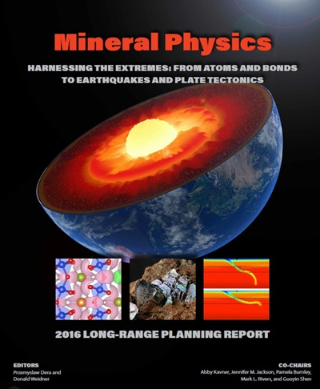
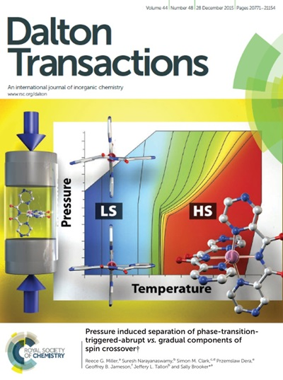

Earth is a very complex and dynamic system, in which global geologic phenomena, such as volcanism, earthquakes or plate 
tectonics have major impact on the human civilization. Proper understanding of these global phenomena requires microscopic 
models of chemical and physical processes, in which rocks, minerals and fluids are involved. 
We employ a variety of lab-based experimental methods to study the effects of pressure and temperature on structure, 
properties and behavior of both natural as well as synthetic materials. Applications of our research range from geology and geophysics, 
through materials science and technology, to engineering and extraterrestrial planet exploration. Among the analytical methods used by our 
group crystallography plays a special role. Crystallographic investigations of minerals and materials at varied thermodynamic conditions provide 
fundamental information about the structural parameters such as density, atom coordination geometry, bond lengths, etc., which govern the physical 
and chemical properties of minerals and are indispensible for building reliable geophysical and geochemical models. In situ high-pressure crystallography,
 in which our group specializes, has been one of the principal analytical tools of Mineral Physics research and has significantly contributed to the 
 development of our field. 

 

 
Recent developments in synchrotron-based high-pressure crystallographic techniques have opened new opportunities to explore the behavior 
of crystals with much smaller sizes (below 1 micrometer) to significantly higher pressures (above 100 GPa) while retaining the main advantages 
of classic technique. With the advantage of these new developments we are chasing long-standing Mineral Physics mysteries and try to discover new 
technological materials with much improved properties and performance.

