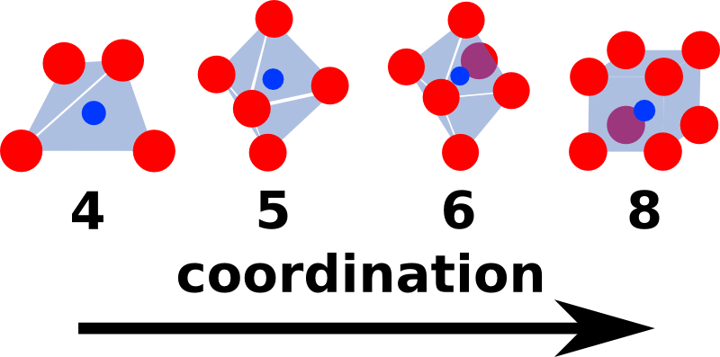
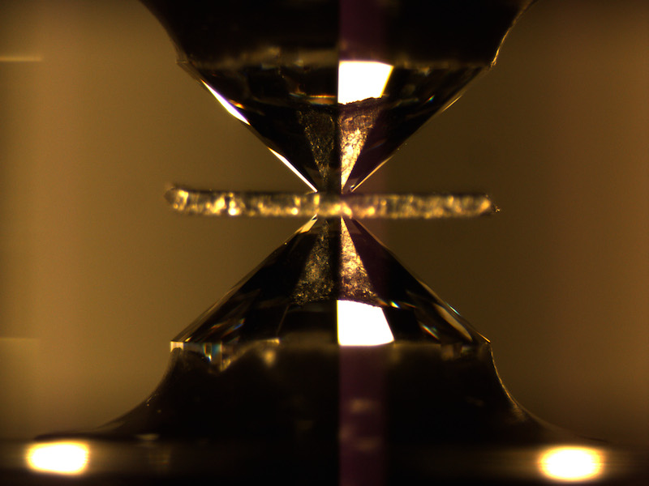
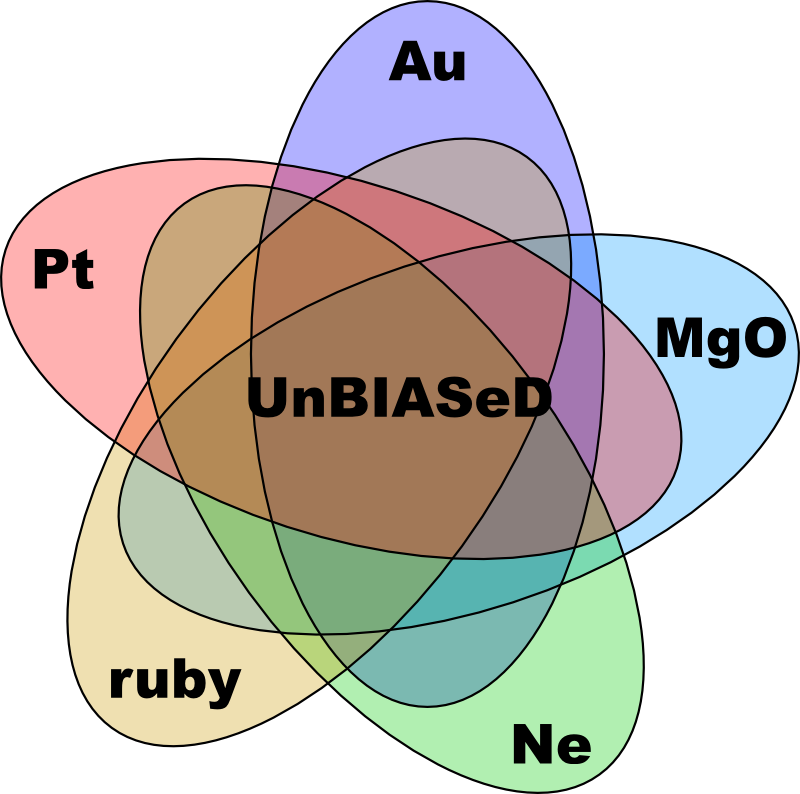
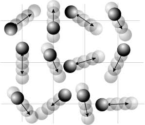

My research interests span a broad range of topics including planetary science, geochemistry, geophysics, and statistical analysis.
In particular, the bulk of my work is focused on understanding the chemistry and thermodynamics of the Earth’s lower mantle.
I approach this topic with a variety of techniques, including diamond anvil cell experiments, thermodynamic modeling of first principles calculations, and simplified atomic-scale modeling.
I have also done work on determining the interior properties of extrasolar planets through their orbital evolution, as well as various applications of Bayesian statistical techniques toward understanding various fields in the geosciences.
Below I describe a number of these research projects in more detail, and you can see a list of my publications [here](publications.html).

###Open Projects found at [github.com/aswolf](http://github.com/aswolf)

In support of the goals of Open Science, to make research more accessible and reproducible (i.e. more scientific), I have begun posting many of my projects on my github site.

 

####I encourage you to take a look and think about what you can do to make your science more open!

##Simplified Modeling of Silicate Liquids at Mantle Conditions 

Determining the evolution of the Earth's mantle since formation is a crucial topic to understanding its present state.
This is particularly true given that temperature and composition are often highly degenerate in seismic observations of the mantle.
It has long been thought that the Earth likely went through one or more periods in which the mantle was predominantly or entirely molten.
This magma ocean scenario is a simple consequence of the extremely large energies involved in terrestrial planet accretion.
Recent experimental and theoretical work have shown that the properties of high pressure silicates are rather different from what was previously supposed, implying that crystallization of a magma ocean proceeds from the center outward rather than from the bottom up.
This shift in our understanding is a consequence of the depths of both crystallization and neutral crystal buoyancy.
Since these parameters are defined by composition-dependent equilibrium conditions, it is important to develop a simple model of silicate liquids that allows rapid determination of equations of state in a large chemically relevant system.
For this project, I have developed the Coordinated Hard Sphere Mixture (CHaSM), which can rapidly predict the behavior of complex silicate liquids over wide ranges in Temperature, Pressure, and Composition.
I am currently applying this general model to a simplified chemical representation of the Earth's mantle with an eye toward later using it to determine the chemical and thermal evolution of a planetary magma ocean.
(*The first CHaSM paper was developed together with Paul Asimow and David Stevenson at Caltech and is currently under review at Geochimica et Cosmochimica Acta, see [publications](publications.html). Further work is underway to extend the model to a wider chemical system.*)

 

##High P-T Diamond Anvil Cell Experiments

 (image from Steve Jacobsen) 

Iron-bearing magnesium silicate perovskite (recently named Bridgmanite) is thought to be the dominant mineral in the Earth's lower mantle, occupying ~80% by volume.
This makes it one of the most crucial phases to understanding the structure and long-term evolution of the Earth.
In this work, I set out to characterize the composition-dependent compression behavior of perovskite at realistic mantle conditions using laser-heated diamond anvil cell experiments.
Synchrotron X-ray diffraction experiments were carried out at the Advanced Photon Source, measuring the high temperature compression curves for (Mg,Fe)SiO3 perovskite in a quasi-hydrostatic neon pressure medium for a range of iron compositions.
The resulting powder diffraction profiles are then fit to obtain perovskite volumes as a function of pressure and temperature.
From the extracted volumes, I construct high temperature equations of state for both Fe-bearing and Fe-free compositions, comparing with careful reanalysis of literature data.
Using Bayesian statistical techniques that are robust to outliers in the dataset, we are able to show that the thermal expansion trends with temperature for perovskite (even in the absence of iron) are considerably higher than previously thought.
(*This work was carried out in close collaboration with Jennifer Jackson at Caltech, and will be submitted soon to EPSL.*)

## Unified Pressure Scales for Hi P-T Experiments

 (modified from wikipedia) 

The structure and dynamics of the Earth's interior give us clues to how the Earth formed and how it has evolved over the last 4.5 billion years.
In order to interpret seismic observations, we rely on high pressure and temperature (high P-T) experiments to determine the behavior of rocky materials at the extreme conditions deep within the Earth.
Unfortunately, we cannot directly measure the pressures in these experiments, but must instead rely on the calibrated behavior of pressure markers such as ruby, gold, platinum, or MgO.
We are therefore highly dependent on a limited set of pressure markers and extremely sensitive to uncertainties in their high P-T properties.
To address the systematic errors in these calibrated pressure scales, we are developing a new unified pressure scale using a Bayesian analysis of published high P-T measurements called the UnBIASeD (**Un**ified **B**ayesian **I**terative **A**nd **S**yst**e**matically **D**etermined) Pressure scale.
As this is an entirely open project, meant to provide both models and easy access to literature data, it is posted on my github page at [github.com/aswolf/unbiased-pscale](https://github.com/aswolf/unbiased-pscale).
(*I am working on this project with two Univ. of Michigan undergraduates, Rong Zhou and Wardah Mohammad Fadil, through the [UROP](http://www.lsa.umich.edu/urop/) undergraduate research program.*)

##Modeling Atomic Ordering in Fe-bearing Perovskite from 1st Principles Calculations

 (from galleryhip.com) 

High quality experimental data is ideally the best standard for determining the thermodynamic properties of earth materials, however it is often difficult and costly to perform experiments at the relevant extreme conditions.
Furthermore, experiments provide a relatively sparse sampling of Pressure-Temperature-Composition space, and so theoretical calculations will always be useful in constructing a detailed overall picture of the thermodynamics of complex systems.
In this work, we use density functional theory (DFT) to calculate the energies and volumes of iron-bearing silicate perovskite at mantle pressures.
These calculations are used to parameterize simplified cation ordering models that can capture the energetic cost of various atomic ordering schemes.
This work is particularly relevant in light of recent work by Zhang (2014), who observed Fe-bearing perovskite to be unstable at high pressure, exolving a new iron-rich hexagonal phase and a nearly Fe-free perovskite.
In this theoretical study, we show that perovskite is highly energetically sensitive to the relative ordering of Mg and Fe atoms on its lattice, inducing them to cluster, and therefore the observed phase break-down is a likely outcome of perovskite's ordering tendencies combined with the novel pressure-temperature pathway explored by Zhang et al.
This work can thus help to reconcile the conflicting reports of Fe exsolution in perovskite diamond anvil cell experiments.
Eventually, we aim to combine this model with a similar model for ferropericlase, the other major phase in the lower mantle, to obtain a complete thermodynamic model for a simplified lower mantle system.
(*This work is being carried out together with Paul Asimow and Razvan Caracas at ENS Lyon.*)

 

##Understanding the Thermodynamics of Melting in Highly Ionic Systems

 (from wikipedia) 

Our knowledge of the thermodynamics of melting for geologic materials plays a very important role in our understanding of how rocks are created and processed in igneous and metamorphic settings, such as in within deep magma chambers or conduits.
We are particularly interested in the pressure and composition dependence of the heat capacity, as it plays a large role in determining the degree of partial melt and the rate of cooling in crustal magmas.
In order to study these properties in the lab, we must be able to take measurements (such as sound speeds) on molten rock at a range of pressures and compositions.
These experiments are extremely challenging and can often lead to as many further questions as they solve.
Recent work done here at Rebecca Lange's lab indicates that a broad range of carbonate minerals show a paradoxical behavior where the heat capacities show clear drops upon melting, opposite the typical behavior for most geologic materials.
Most minerals gain so much configurational entropy upon melting, as atoms break free from the crystal lattice, that the melt experiences a large jump in heat capacity relative to the solid.
We are developing new ionic potentials for use in empirical molecular dynamics simulations to explore on an atomic level how configurational and vibrational entropy responds to melting for these materials.
(*I am working on this project with University of Michigan graduate student Sean Hurt, as a theoretical compliment to his other experimental Ph.D. work.*)

##Bayesian Data Analysis Applications in Geosciences
Many scientific investigations require only a basic knowledge of statistics in order to obtain reasonable results.
Unfortunately, all too often researchers will apply a simple statistical method when the data really requires more sophisticated techniques.
Starting early on in graduate school, I began to collaborate with friends and colleagues to help provide the statistical know-how to carry out their investigations when the observation type, data quality, or system complexity ruled out standard simple approaches.
This has lead me to collaborations in a wide range of areas:

####Bayes' Theorem

 (from wikipedia) 

* measuring lake depths on Titan
* inferring the chemical composition of extrasolar planetary atmospheres
* disentangling the effects of temperature, drought, and fire on the carbon cycle
* constraining the resurfacing history of Venus based on its crater record

These publications are some of the most fun because they represent tricky statistical problems that are spread widely across science.
(*For more information on these projects, see my [publication](publication.html)*)

##Developing Open Source Scientific Tools

 (from wikipedia) 

The work that we can do is largely shaped by the tools we have available.
We can always spend time building new tools when none exist, and in science, we do this quite frequently.
But spending time reinventing the wheel is rarely wise and the range of ideas we have for new studies are often strongly tethered to our notions of what is already possible.
It is thus to our collective benefit to share as much as possible the tools and datasets that we have worked to develop, better enabling everyone to reap the rewards of our past efforts.
To this end, I am involved in a number of projects to make publicly available the various software tools I develop in the course of my work.
Most of these tools (written in Python and MATLAB) are focused on analyzing experimental and theoretical mineral physics data, as well as performing theoretical mineral physics simulations.
As noted at the top of this page, I am making these tools freely available for public use or re-purposing, distributing them from my repositories on github [github.com/aswolf](http://github.com/aswolf).
(*Part of this work helps to support an EAR/Geoinformatics grant with Przemek Dera and colleagues)*

